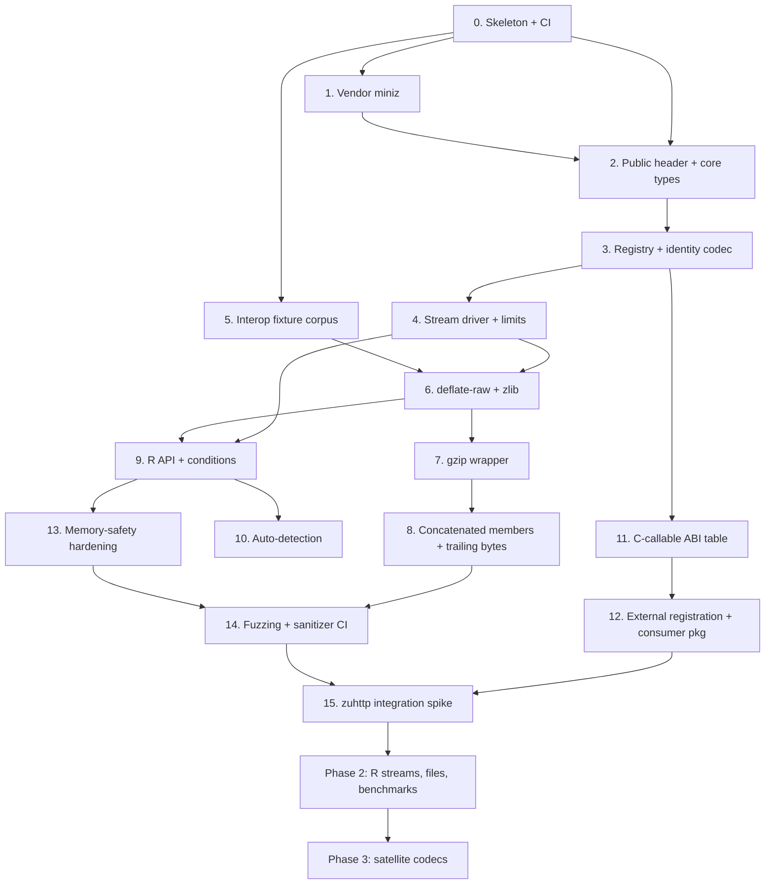

# zukomp Roadmap

Companion to [design-zukomp.md](design-zukomp.md). Every stage is small, independently verifiable, and leaves the package in a state where `R CMD check` passes and `devtools::test()` is green. Nothing here requires a big-bang integration.

**Rule for every stage:** it is not done until its verification block runs clean *and* the previous stages' tests still pass.

---

## Stage map



Stages 5 and 11 are off the critical path and can be done whenever there is a spare afternoon. Stage 12 is the one that proves the package's central claim, so do not let it slide past Stage 15.

---

# Testing strategy

The strategy is fixed once, here, and every stage inherits it. Stage-specific tests are listed under each stage.

## Setup

```r
usethis::use_testthat(3)
```

`DESCRIPTION`:

```
Suggests:
    testthat (>= 3.2.0),
    withr
Config/testthat/edition: 3
Config/testthat/parallel: true
```

Parallel is safe because every test is self-sufficient (see below) and the only global state — the codec registry — is written at DLL init and read-only afterwards. If that ever stops being true, parallel must be turned off in the same commit.

`zukomp` itself has **no `Imports`**. Test-only dependencies live in `Suggests` and are never referenced from `R/`.

## File layout

Tests mirror the source, one test file per R file and one per C module that has an R-visible surface:

```
tests/
├── testthat.R
└── testthat/
    ├── helper-corpus.R        # payload constructors
    ├── helper-expect.R        # custom expectations
    ├── helper-skip.R          # project skip conditions
    ├── setup-state.R          # global state inspector
    ├── fixtures/              # externally generated, committed, never regenerated at test time
    │   ├── gzip/
    │   ├── zlib/
    │   └── MANIFEST.tsv
    ├── _snaps/                # condition-message snapshots
    ├── test-codecs.R          # registry, komp_codecs(), availability
    ├── test-compress.R
    ├── test-decompress.R
    ├── test-detect.R
    ├── test-levels.R
    ├── test-limits.R          # max_output, max_ratio, overflow
    ├── test-conditions.R      # condition classes and metadata
    ├── test-gzip.R            # wrapper, header variants, members
    ├── test-stream.R          # chunk-boundary sweeps via the C harness
    ├── test-truncation.R
    ├── test-corruption.R
    ├── test-interop.R         # fixtures only, no external processes
    └── test-abi.R             # symbol audit, header hygiene, status coverage
```

## Design rules

**Self-sufficient.** Every test creates its own inputs inside the `test_that()` block. No ambient objects at file scope. Repetition beats cleverness here — when a truncation test fails at byte 217 you want the failing test to contain everything needed to reproduce it.

**Self-contained.** Anything that touches global state uses `withr::local_*()`. Randomised payloads use `withr::local_seed()` so a failure is reproducible from the test alone:

```r
test_that("gzip round-trips random bytes", {
  withr::local_seed(20260907)
  x <- new_payload("random", 64 * 1024)
  expect_roundtrip(x, "gzip")
})
```

**Class-based error assertions, never message matching.** Messages are allowed to be reworded; classes are the contract.

```r
expect_error(komp_decompress(z, "gzip"), class = "zukomp_checksum_error")
```

Message *wording* is covered separately by snapshots, so a rewording shows up as one reviewable snapshot diff instead of forty broken tests.

**Order independence.** `devtools::test(shuffle = TRUE)` is part of the definition of done for every stage. The registry makes ordering bugs plausible, so this matters more than usual.

**State leakage detection.** `tests/testthat/setup-state.R`:

```r
testthat::set_state_inspector(function() {
  list(
    options = options(),
    codecs  = if (exists("komp_codecs")) komp_codecs()$id else NULL
  )
})
```

This catches a test that registers a codec, or flips `zukomp.max_output`, and forgets to clean up.

## Helpers

`helper-corpus.R` — payload constructors rather than stored data, so tests are cheap and parameterisable:

```r
new_payload <- function(kind, n = 4096L) {
  switch(kind,
    empty        = raw(0),
    one_byte     = as.raw(0x7f),
    zeros        = raw(n),
    ones         = as.raw(rep(0xffL, n)),
    ascii        = charToRaw(substr(strrep("the quick brown fox jumps. ", n), 1L, n)),
    utf8         = charToRaw(enc2utf8(substr(strrep("café 中文 über ", n), 1L, n))),
    random       = as.raw(sample.int(256L, n, replace = TRUE) - 1L),
    structured   = charToRaw(paste0('{"id":', seq_len(n %/% 16L), ',"v":"x"}', collapse = ",")),
    stop("unknown payload kind: ", kind)
  )
}

payload_kinds <- function() {
  c("empty", "one_byte", "zeros", "ones", "ascii", "utf8", "random", "structured")
}
```

`helper-expect.R` — domain expectations that make failures readable:

```r
expect_roundtrip <- function(x, codec, level = NULL) {
  z <- komp_compress(x, codec = codec, level = level)
  expect_type(z, "raw")
  expect_identical(komp_decompress(z, codec = codec), x)
  invisible(z)
}

expect_chunked_roundtrip <- function(x, codec, in_chunk, out_chunk) {
  z <- komp_compress(x, codec = codec)
  got <- zu_test_stream(z, codec = codec, mode = "decode",
                        in_chunk = in_chunk, out_chunk = out_chunk)
  expect_identical(got, x)
}

expect_codec_error <- function(expr, class) {
  err <- expect_error(expr, class = class)
  expect_true(all(c("codec", "input_bytes", "output_bytes", "native_status") %in% names(err)))
  invisible(err)
}
```

`helper-skip.R`:

```r
skip_if_no_slow_tests <- function() {
  skip_on_cran()
  if (!identical(Sys.getenv("ZUKOMP_SLOW_TESTS"), "true")) {
    skip("set ZUKOMP_SLOW_TESTS=true to run exhaustive sweeps")
  }
}
```

## The C test harness

The R streaming API is phase 2, but chunk-boundary correctness must be tested from Stage 6 — that is precisely the property `zuhttp` depends on and the one that silently rots.

Ship an unexported, always-compiled `.Call` entry point:

```r
zu_test_stream(bytes, codec, mode = c("encode", "decode"),
               in_chunk, out_chunk, flush_every = NULL)
```

It drives the C stream driver with the requested input and output chunk sizes and returns the concatenated result. It is documented as internal, is not exported, and its `.Call` symbol name is prefixed `zukomp_test_`. This is the single most valuable piece of test infrastructure in the package.

## Fixtures: interop without external processes

Testing against system `gzip` or Python at test time fails on CRAN, which guarantees neither. Instead:

- `tools/make-fixtures.R` runs **offline, by a maintainer**, shelling out to `gzip`, `zlib`, Python, and `R`'s own `memCompress()`.
- It writes `tests/testthat/fixtures/<codec>/<name>.bin` plus the expected plaintext, and records generator + version + sha256 in `fixtures/MANIFEST.tsv`.
- Tests read them with `test_path()` and never regenerate:

```r
test_that("decodes gzip produced by external encoders", {
  manifest <- read.delim(test_path("fixtures", "MANIFEST.tsv"))
  for (i in seq_len(nrow(manifest))) {
    row <- manifest[i, ]
    if (row$codec != "gzip") next
    z <- readBin(test_path("fixtures", "gzip", row$file), "raw", row$bytes)
    expect_identical(komp_decompress(z, "gzip"), new_payload(row$payload, row$n),
                     info = row$generator)
  }
})
```

The corpus must include, at minimum: `gzip -1`/`-9`, gzip with `FNAME` (i.e. plain `gzip file`), gzip with `FCOMMENT`, gzip with `FEXTRA`, gzip with `FHCRC`, a multi-member concatenation, zlib at several levels, and raw DEFLATE from Python's `zlib.compressobj(wbits=-15)`.

The reverse direction — external decoders accepting `zukomp` output — is a maintainer script (`tools/check-interop.sh`) run in CI, not a testthat test.

## Test taxonomy

| family | shape | CRAN |
|---|---|---|
| round-trip grid | codec × payload kind × level ∈ {min, default, max} | yes, small `n` |
| chunk-boundary sweep | in/out ∈ {1, 2, 3, 7, 31, 32, 4096} + random splits | yes, subset |
| truncation sweep | every prefix length must error | sampled on CRAN, exhaustive off |
| corruption | flip bits in header / body / checksum / trailer | yes |
| limits | `max_output`, `max_ratio`, growth overflow | yes, tiny synthetic limits |
| detection | each codec's magic; negative cases must error | yes |
| registry | availability, unknown codec, duplicate registration | yes |
| conditions | class + metadata for each failure mode | yes |
| snapshots | message wording for each condition | yes |
| interop | committed fixtures | yes |
| large buffers | ≥ 64 MiB | **no** — `skip_if_no_slow_tests()` |
| ABI/symbol audit | no vendored symbol escapes | yes |

**CRAN budget: the full suite finishes in under 60 seconds.** Exhaustive sweeps live behind `skip_if_no_slow_tests()` and run in CI.

## Decompression-bomb tests use tiny limits

Never allocate large memory to prove a limit works:

```r
test_that("max_output stops a bomb", {
  bomb <- komp_compress(raw(10 * 1024^2), "gzip")   # ~10 MiB of zeros, tiny compressed
  expect_codec_error(
    komp_decompress(bomb, "gzip", max_output = 1024),
    "zukomp_output_limit"
  )
})
```

## What is deliberately not testthat

| concern | where |
|---|---|
| fuzzing (libFuzzer / AFL++) | `fuzz/`, `.Rbuildignore`d, CI job |
| ASan / UBSan / MSan | CI job on `rocker/r-devel-san` |
| valgrind | CI job, `R CMD check --use-valgrind` |
| `PROTECT` discipline | CI job, `rchk` |
| cross-package ABI consumption | CI job building the Stage-12 consumer package |
| external decoder interop | `tools/check-interop.sh`, CI job |
| benchmarks | `bench/`, not part of check |

---

# Stages

## Stage 0 — Skeleton and CI

**Goal:** a package that installs, checks clean, and has somewhere to put tests.

**Do:** fill in `DESCRIPTION` (title, description, `Authors@R`, `License: MIT + file LICENSE`); `usethis::use_mit_license()`; `usethis::use_testthat(3)`; fix `R/zukomp-package.R` so the roxygen `@useDynLib zukomp, .registration = TRUE` block is well-formed and `NAMESPACE` is regenerated with the `useDynLib` directive; add `src/init.c` registering zero routines; add GitHub Actions `R-CMD-check` on {ubuntu, macos, windows} × {release, oldrel-1, devel}.

**Verify:**
```r
devtools::document(); devtools::check()   # 0 errors, 0 warnings, 0 notes
```
`grep useDynLib NAMESPACE` is non-empty. CI green on all nine cells.

**Not this stage:** any codec, any C beyond `init.c`.

---

## Stage 1 — Vendor miniz

**Goal:** miniz compiles into the package, trimmed, with reproducible provenance.

**Do:** `src/vendor/miniz/{miniz.c,miniz.h,LICENSE}` from a pinned 3.x release; `tools/vendor/manifest.tsv` with repo, tag, commit, sha256, license, defines; `tools/vendor/fetch` and `tools/vendor/verify`; `src/Makevars` with the five defines from design §12; a temporary `.Call` returning the miniz version string.

**Verify:**
```r
devtools::check()                      # all three platforms via CI
zukomp:::zu_miniz_version()            # returns the pinned version
```
```sh
tools/vendor/verify                    # tree matches manifest sha256
nm -g src/zukomp.so | grep -c mz_zip   # 0
nm -g src/zukomp.so | grep -c tdefl_write_image  # 0
```
A first `test-abi.R` asserting no `mz_zip_*` / PNG symbol is present. This test is the guard against an upstream update silently re-adding archive code.

**Exit:** builds on Windows, macOS, Linux with no external library; `verify` is wired into CI.

---

## Stage 2 — Public header and core types

**Goal:** the ABI's vocabulary exists and is self-consistent, before any codec does.

**Do:** `inst/include/zukomp.h` with `zu_status`, `zu_codec`, `zu_flush`, `zu_buffer`, `zu_encoder_opts`, `zu_decoder_opts`, `zu_codec_info`, opaque `zu_encoder`/`zu_decoder`, guard `ZUKOMP_H`, `extern "C"` wrapper. `src/zu_status.c` with `zu_status_string()`.

**Verify:**
```sh
# header compiles standalone as C99 with no R, no miniz
printf '#include <zukomp.h>\nint main(void){return 0;}\n' > /tmp/h.c
cc -std=c99 -Wall -Wextra -Werror -Iinst/include -c /tmp/h.c -o /dev/null
```
```r
test_that("every status has a string", {
  # zukomp:::zu_all_status_strings() walks 0..ZU_ERR_INTERNAL
  expect_false(any(is.na(zukomp:::zu_all_status_strings())))
  expect_false(any(zukomp:::zu_all_status_strings() == "unknown"))
})
```
Plus a `test-abi.R` check that `inst/include/zukomp.h` contains no `miniz`, no `R.h`, no `Rinternals.h`, and no `SEXP` — a plain `grep` over the installed header.

---

## Stage 3 — Registry and the identity codec

**Goal:** the extensibility mechanism, exercised by the cheapest possible codec.

**Do:** `src/zu_registry.c` — a fixed-capacity table of `const zu_codec_vtable *`, `zu_register_codec()`, `zu_codec_lookup()`, `zu_codec_available()`, `zu_codec_get_info()`, `zu_codec_list()`. `src/codec_identity.c` — a pass-through vtable. `R/codecs.R` — `komp_codecs()`, `komp_codec_available()`.

**Verify:**
```r
test_that("identity is registered and described", {
  d <- komp_codecs()
  expect_true("identity" %in% d$id)
  expect_true(d$available[d$id == "identity"])
  expect_identical(d$source[d$id == "identity"], "zukomp")
})

test_that("unknown codecs are a clean error, not a crash", {
  expect_codec_error(komp_codec_available("nope"), "zukomp_unsupported_codec")
})

test_that("declared-but-absent codecs report unavailable", {
  expect_false(komp_codec_available("zstd"))
})
```
Run with `shuffle = TRUE`; add `setup-state.R`.

**Exit:** `komp_codecs()` is a real data frame with the columns from design §6. Adding a row requires touching no header.

---

## Stage 4 — Stream driver and limits

**Goal:** the core loop, the growing output buffer, and every security limit — all testable through `identity` before a single real codec exists.

**Do:** `src/zu_stream.c` — the drive loop over `zu_buffer` cursors, `zu_encoder_new/process/reset/free` and the decoder quartet dispatching through the vtable. `src/zu_buf.c` — `zu_grow`, `zu_add`, `zu_mul` with overflow checks. Limit enforcement (`max_output`, `max_ratio`) in the driver, **not** in codecs. The `zu_test_stream()` harness.

**Verify:**
```r
test_that("identity streams at every chunk boundary", {
  x <- new_payload("ascii", 10007L)   # deliberately prime-ish
  for (cin in c(1, 2, 3, 7, 31, 32, 4096)) {
    for (cout in c(1, 2, 3, 7, 31, 32, 4096)) {
      expect_chunked_roundtrip(x, "identity", cin, cout)
    }
  }
})

test_that("max_output is enforced by the driver", {
  expect_codec_error(
    zu_test_stream(new_payload("zeros", 4096), "identity", "decode", max_output = 100),
    "zukomp_output_limit"
  )
})

test_that("growth arithmetic refuses to overflow", {
  # zu_test_grow() asks the driver to grow a buffer past SIZE_MAX
  expect_codec_error(zukomp:::zu_test_grow(near_size_max = TRUE), "zukomp_memory_error")
})
```

**Exit:** the limit machinery is proven before any codec can be blamed for it. Every codec added later inherits it for free.

---

## Stage 5 — Interop fixture corpus *(off critical path)*

**Goal:** offline-generated, committed test vectors so interop testing never shells out during `R CMD check`.

**Do:** `tools/make-fixtures.R` producing the corpus listed under *Fixtures* above; `tests/testthat/fixtures/MANIFEST.tsv` with generator, version, codec, payload kind, n, file, sha256; `.Rbuildignore` the generator, **not** the fixtures.

**Verify:**
```sh
Rscript tools/make-fixtures.R --check   # regenerates to a temp dir, diffs against committed
```
```r
test_that("fixture manifest matches the files on disk", {
  m <- read.delim(test_path("fixtures", "MANIFEST.tsv"))
  for (i in seq_len(nrow(m))) {
    p <- test_path("fixtures", m$codec[i], m$file[i])
    expect_true(file.exists(p))
    expect_identical(unname(tools::md5sum(p)), m$md5[i])
  }
})
```
Fixtures are inert until Stage 6, which is why this stage can happen any time after Stage 0.

---

## Stage 6 — `deflate-raw` and `zlib`

**Goal:** the first real codecs, on the existing driver.

**Do:** `src/codec_deflate.c` — two vtables over miniz's streaming API, sharing an implementation and differing in the zlib-header flag. Level mapping and `[level_min, level_max, level_default]`. `bound()`.

**Verify:**
```r
test_that("round-trips the payload corpus at every level extreme", {
  for (codec in c("deflate-raw", "zlib")) {
    info <- komp_codecs()[komp_codecs()$id == codec, ]
    for (kind in payload_kinds()) {
      withr::local_seed(1L)
      x <- new_payload(kind, 8192L)
      for (lvl in c(info$level_min, info$level_default, info$level_max)) {
        expect_roundtrip(x, codec, lvl)
      }
    }
  }
})

test_that("decodes zlib and raw DEFLATE from external encoders", { ... fixtures ... })

test_that("streams correctly at pathological boundaries", {
  x <- new_payload("structured", 65537L)
  for (cin in c(1, 2, 3, 7, 31, 32, 4096)) expect_chunked_roundtrip(x, "zlib", cin, 1)
  for (cout in c(1, 2, 3, 7, 31, 32, 4096)) expect_chunked_roundtrip(x, "zlib", 1, cout)
})

test_that("zlib detects Adler-32 corruption", {
  z <- komp_compress(new_payload("ascii"), "zlib")
  z[length(z)] <- as.raw(bitwXor(as.integer(z[length(z)]), 0xff))
  expect_codec_error(komp_decompress(z, "zlib"), "zukomp_checksum_error")
})

test_that("truncation never reports success", {
  z <- komp_compress(new_payload("ascii", 4096L), "zlib")
  pos <- if (identical(Sys.getenv("ZUKOMP_SLOW_TESTS"), "true")) {
    seq_len(length(z) - 1L)
  } else {
    sort(unique(c(1:16, sample.int(length(z) - 1L, 32L))))
  }
  for (i in pos) expect_error(komp_decompress(z[seq_len(i)], "zlib"), class = "zukomp_error")
})
```

**Exit:** criteria 2, 3, 4, 5 and 6 from design §24 hold for two codecs.

---

## Stage 7 — gzip wrapper

**Goal:** RFC 1952, owned by this package, correct on real-world headers.

**Do:** `src/zu_gzip.c` — header parse (`FTEXT`, `FHCRC`, `FEXTRA`, `FNAME`, `FCOMMENT`), CRC-32 over the payload, ISIZE validation, deterministic encoder (`mtime = 0`, `OS = 255`, no name, no comment). Payload delegated to the Stage-6 DEFLATE implementation.

**Verify:**
```r
test_that("parses every optional header field", {
  for (f in c("plain", "fname", "fcomment", "fextra", "fhcrc", "all_flags")) {
    z <- readBin(test_path("fixtures", "gzip", paste0(f, ".gz")), "raw", file.size(...))
    expect_identical(komp_decompress(z, "gzip"), fixture_plaintext(f))
  }
})

test_that("ISIZE and CRC mismatches are distinct errors", {
  z <- komp_compress(new_payload("ascii", 1000L), "gzip")
  bad_crc <- z; bad_crc[length(z) - 7L] <- as.raw(0x00)
  expect_codec_error(komp_decompress(bad_crc, "gzip"), "zukomp_checksum_error")
  bad_isize <- z; bad_isize[length(z)] <- as.raw(0xff)
  expect_codec_error(komp_decompress(bad_isize, "gzip"), "zukomp_checksum_error")
})

test_that("gzip output is byte-deterministic", {
  x <- new_payload("ascii", 5000L)
  expect_identical(komp_compress(x, "gzip"), komp_compress(x, "gzip"))
})

test_that("a header truncated mid-FNAME errors", { ... })
```
Plus the truncation sweep from Stage 6, applied to gzip, with the header bytes covered exhaustively even on CRAN (they are few and they are where the bugs are).

**Exit:** external `gzip -d` accepts `zukomp` output (`tools/check-interop.sh` in CI).

---

## Stage 8 — Concatenated members and trailing bytes

**Goal:** the two behaviours that are cheap now and expensive to retrofit.

**Do:** decoder continues into a following gzip member; `src_pos` reports exact consumption; `ZU_DEC_REJECT_TRAILING`; `zukomp_trailing_bytes` condition.

**Verify:**
```r
test_that("concatenated gzip members concatenate payloads", {
  a <- komp_compress(charToRaw("hello "), "gzip")
  b <- komp_compress(charToRaw("world"), "gzip")
  expect_identical(komp_decompress(c(a, b), "gzip"), charToRaw("hello world"))
})

test_that("a member split across a chunk boundary still joins", {
  a <- komp_compress(charToRaw("hello "), "gzip")
  b <- komp_compress(charToRaw("world"), "gzip")
  for (cin in c(1, 3, 7, length(a) - 1L, length(a), length(a) + 1L)) {
    expect_identical(
      zu_test_stream(c(a, b), "gzip", "decode", in_chunk = cin, out_chunk = 4L),
      charToRaw("hello world")
    )
  }
})

test_that("junk after a zlib stream is rejected", {
  z <- c(komp_compress(new_payload("ascii"), "zlib"), as.raw(c(1, 2, 3)))
  expect_codec_error(komp_decompress(z, "zlib"), "zukomp_trailing_bytes")
})

test_that("a truncated second member does not silently succeed", {
  a <- komp_compress(charToRaw("hello "), "gzip")
  b <- komp_compress(charToRaw("world"), "gzip")
  expect_error(komp_decompress(c(a, head(b, -3L)), "gzip"), class = "zukomp_error")
})
```
That last test is the one that catches "we treated a partial member as end-of-stream".

---

## Stage 9 — R API and conditions

**Goal:** the user-facing surface, built on the same stream driver as everything else.

**Do:** `R/compress.R`, `R/decompress.R`, `R/conditions.R`, `R/info.R`. Whole-buffer functions drive the streaming engine — **no second code path**. Condition constructors carrying `codec`, `input_bytes`, `output_bytes`, `native_status`. `options(zukomp.max_output = 1024^3)` default. `komp_info()`.

**Verify:**
```r
test_that("whole-buffer and streaming agree exactly", {
  withr::local_seed(7L)
  x <- new_payload("random", 20000L)
  z <- komp_compress(x, "gzip")
  expect_identical(komp_decompress(z, "gzip"),
                   zu_test_stream(z, "gzip", "decode", in_chunk = 13L, out_chunk = 17L))
})

test_that("the default output cap is finite", {
  expect_true(is.finite(eval(formals(komp_decompress)$max_output)))
})

test_that("every condition class carries its metadata", {
  expect_codec_error(komp_decompress(as.raw(c(0x1f, 0x8b, 0x08)), "gzip"), "zukomp_truncated")
})

test_that("error messages are stable", {
  expect_snapshot(error = TRUE, komp_compress(raw(1), codec = "nope"))
  expect_snapshot(error = TRUE, komp_compress(raw(1), "gzip", level = 99))
  expect_snapshot(error = TRUE, komp_decompress(as.raw(1:4), "gzip"))
})

test_that("character input is rejected in v1", {
  expect_codec_error(komp_compress("text", "gzip"), "zukomp_error")
})
```

---

## Stage 10 — Auto-detection

**Goal:** `codec = "auto"` as a registry property, with the refusal to guess made explicit.

**Do:** `zu_sniff()` walking magic-first then predicate sniffers; `komp_detect()`; `zukomp_undetectable_codec`.

**Verify:**
```r
test_that("detects what has magic", {
  expect_identical(komp_detect(komp_compress(new_payload("ascii"), "gzip")), "gzip")
  expect_identical(komp_detect(komp_compress(new_payload("ascii"), "zlib")), "zlib")
})

test_that("refuses to guess headerless formats", {
  z <- komp_compress(new_payload("ascii"), "deflate-raw")
  expect_identical(komp_detect(z), NA_character_)
  expect_codec_error(komp_decompress(z, "auto"), "zukomp_undetectable_codec")
})

test_that("random bytes are not mistaken for zlib", {
  withr::local_seed(11L)
  hits <- vapply(1:2000, function(i) komp_detect(as.raw(sample.int(256L, 8L, TRUE) - 1L)),
                 character(1))
  expect_true(mean(!is.na(hits)) < 0.01)   # zlib's header predicate is weak by construction
})
```
That last test is the honest one: it documents the false-positive rate rather than pretending detection is exact.

---

## Stage 11 — C-callable ABI table *(off critical path)*

**Goal:** the downstream entry point, versioned.

**Do:** `zukomp_api_v1` struct with `abi_version` + `struct_size`; `zukomp_get_api(uint32_t requested)` returning `NULL` on mismatch; `R_RegisterCCallable` in `R_init_zukomp`; `R_useDynamicSymbols(dll, FALSE)`, `R_forceSymbols(dll, TRUE)`; `inst/include/zukomp-r.h` with the **lazy, cached** resolver from design §15.

**Verify:**
```sh
cc -std=c99 -Wall -Wextra -Werror -Iinst/include $(R RHOME)/include ... -c probe.c
```
```r
test_that("the API table is self-describing", {
  expect_identical(zukomp:::zu_abi_version(), 1L)
  expect_true(zukomp:::zu_api_struct_size() > 0L)
})

test_that("a future ABI request is refused, not guessed", {
  expect_null(zukomp:::zu_get_api(999L))
})
```

---

## Stage 12 — External registration and the consumer package

**Goal:** prove extensibility instead of claiming it. **This is the stage that validates the whole design.**

**Do:** `tests/consumer/zukomptest/` — a minimal package with `Imports: zukomp`, `LinkingTo: zukomp`, an `importFrom(zukomp, komp_codecs)` in `NAMESPACE`, that (a) calls `komp_decompress`'s C path through the API table, and (b) **registers its own codec** — a trivial XOR-0x5A "cipher" codec at `ZU_CODEC_VENDOR_BASE` — in its `R_init_zukomptest`. `.Rbuildignore` it. CI job installs `zukomp`, then the consumer, then runs its tests.

**Verify:**
```r
# inside the consumer package's own tests
test_that("consumer sees zukomp's codecs", {
  expect_true("gzip" %in% zukomp::komp_codecs()$id)
})

test_that("an externally registered codec is a first-class citizen", {
  d <- zukomp::komp_codecs()
  expect_true("xor5a" %in% d$id)
  expect_identical(d$source[d$id == "xor5a"], "zukomptest")
  x <- as.raw(1:100)
  expect_identical(zukomp::komp_decompress(zukomp::komp_compress(x, "xor5a"), "xor5a"), x)
})

test_that("core limits apply to a third-party codec", {
  expect_error(
    zukomp::komp_decompress(zukomp::komp_compress(raw(10000), "xor5a"), "xor5a",
                            max_output = 10),
    class = "zukomp_output_limit"
  )
})
```
That third test is the payoff of putting limits in the driver: a codec nobody at `zukomp` reviewed still cannot bypass the output cap.

**Exit:** design §24 criteria 10 and 12 hold. The satellite-package plan (design §11) is now de-risked.

---

## Stage 13 — Memory-safety hardening

**Goal:** close the longjmp and interrupt holes before fuzzing finds them the hard way.

**Do:** audit every `.Call` entry against design §13: no `Rf_error()` inside the codec loop; growing buffers on `R_alloc` with `vmaxget`/`vmaxset` or owned by an external pointer with `R_RegisterCFinalizerEx(..., TRUE)`; `R_CheckUserInterrupt()` in the whole-buffer loop, placed where it cannot strand an allocation.

**Verify:**
```sh
R CMD check --use-valgrind          # no definitely-lost, no indirectly-lost
```
CI job on `rocker/r-devel-san`; `rchk` job clean.
```r
test_that("an error mid-decompression does not leak", {
  skip_if_no_slow_tests()
  before <- gc(reset = TRUE)
  for (i in 1:2000) {
    try(komp_decompress(corrupt_stream(), "gzip", max_output = 1024), silent = TRUE)
  }
  expect_lt(gc()[2, 2] - before[2, 2], 50)   # MB drift
})

test_that("decompression is interruptible", {
  skip_on_cran()
  # setTimeLimit + a large bomb under a generous max_output
})
```

---

## Stage 14 — Fuzzing and sanitizer CI

**Goal:** continuous coverage of the parsers.

**Do:** `fuzz/` (Rbuildignored) with libFuzzer targets against the raw ABI, no R involved: `fuzz_decode_raw`, `fuzz_decode_zlib`, `fuzz_decode_gzip`, `fuzz_gzip_header`, `fuzz_sniff`, `fuzz_stream_boundaries` (input split driven by fuzzer bytes). Seed corpus from `tests/testthat/fixtures/` plus minimised crashers. CI: 60-second smoke run per target on PRs, longer nightly.

**Verify:** all targets build under `-fsanitize=fuzzer,address,undefined`; the smoke run is clean; any crasher is minimised, committed to `fuzz/corpus/regressions/`, and gains a testthat regression test.

---

## Stage 15 — `zuhttp` integration spike

**Goal:** the actual reason the package exists.

**Do:** in `zuhttp`: `Imports: zukomp` + `LinkingTo: zukomp` + an `importFrom`; `Accept-Encoding` **built from `zu_codec_list()`**, not hardcoded; response body decode through `zu_decoder_process()` into the existing sink; `deflate` → zlib with the documented raw retry; `max_decompressed_bytes`/`max_decompression_ratio` wired to `zu_decoder_opts`; chained decoding for `Content-Encoding: gzip, br`.

**Verify:**
```r
test_that("Accept-Encoding follows zukomp's registry", {
  expect_match(zuhttp:::default_accept_encoding(), "gzip")
  expect_false(grepl("br", zuhttp:::default_accept_encoding()))   # until zukomp.brotli exists
})
```
Plus: a gzip response decoded incrementally with no whole-body buffering (assert peak allocation), a `deflate` response in both zlib and raw flavours, a decompression bomb stopped by `zuhttp`'s configured limits, and `grep -r miniz` over `zuhttp/src` returning nothing.

**Exit:** design §24 criteria 11 and 14.

---

## Phase 2 (post-v1)

| stage | goal | verification |
|---|---|---|
| 16 | R streaming API (`komp_stream_new/write/finish`) over external pointers with finalizers | the Stage-4/6 chunk sweeps re-run through the R API instead of `zu_test_stream()`; finalizer runs under `gc()` |
| 17 | file helpers, streaming internally | round-trip 100 MiB with bounded peak memory (`skip_on_cran`) |
| 18 | `komp_compress_text(x, encoding = "UTF-8")` | explicit encoding tests incl. latin1 → UTF-8 |
| 19 | benchmark vignette vs `memCompress()` and system zlib | `bench/`, not part of check |

## Phase 3

| stage | goal | verification |
|---|---|---|
| 20 | `zukomp.brotli` — first real satellite; `br` for `zuhttp` | Stage-12 tests re-run against a real codec; `Accept-Encoding` gains `br` with no `zuhttp` change |
| 21 | `zukomp.zstd` | same, plus dictionary API design |
| 22 | `zukomp.lz4`, `zukomp.snappy` (C++ confined to the satellite) | same |

Each satellite is its own repository, its own `manifest.tsv`, its own fuzz targets, and reuses this testing strategy wholesale — which is the point of putting the strategy in the core.

---

## Definition of done, every stage

1. `devtools::document()` and `devtools::check()`: 0 errors, 0 warnings, 0 notes.
2. `devtools::test(shuffle = TRUE)` green.
3. CI green on all nine {OS × R version} cells.
4. New public surface has roxygen docs with runnable examples.
5. `tools/vendor/verify` clean if anything under `src/vendor/` moved.
6. The stage's own verification block above passes.
7. Full CRAN test suite still under 60 seconds.
